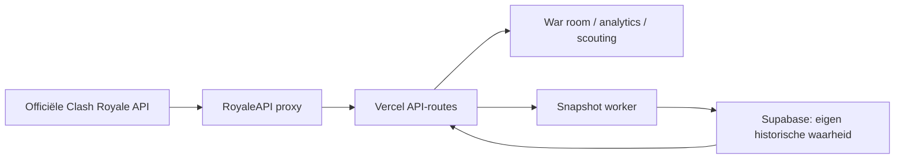

# Clash Royale API — mogelijkheden, grenzen en uitbreidingsplan voor het Clan War-systeem

> Status: 2 augustus 2026
> Scope: de **officiële Supercell Clash Royale API**, gebruikt via `https://proxy.royaleapi.dev/v1`. Dit is nadrukkelijk iets anders dan de voormalige publieke RoyaleAPI-data-API; die is beëindigd.
> Doel: één technisch en productmatig referentiedocument voor Brabant Royale (hoofclan `#9YP8UY`, BR2 en BR3).

## Kort antwoord

Met de officiële API kunnen we een sterk systeem bouwen voor:

- **live River Race-aansturing:** voortgang, deelnemers, fame, repair points, gebruikte decks, bootaanvallen en tegenstanders;
- **eigen clan-war-analyse over tijd:** betrouwbaarheid, gemiste decks, streaks, promotie-/degradatieadvies en MVP's, **mits we zelf snapshots blijven opslaan**;
- **spelerscreening:** profielsterkte, trophies en kaartcollectie (dus L15/L16-diepte), plus onze eigen geobserveerde war-historie;
- **clanbeheer-informatie:** actuele leden, rollen, trophies, clanstatus en geconstateerde joins/leaves tussen eigen snapshots;
- **context:** kaarten, locaties, leaderboards en openbare toernooien.

De API kan **niet** zelfstandig een volledige war-manager zijn. Er is geen schrijf-API, webhook, complete levenslange war-historie, betrouwbare externe war-reputatie of live gebeurtenisfeed. Daarom is de juiste strategie: de officiële API gebruiken als live bron, en onze eigen database als historische waarheid vanaf het moment van meten.

## 1. Huidige uitgangspositie in deze repository

De basis is al goed en sluit aan op wat de officiële API werkelijk levert.

| Onderdeel | Huidige bron | Wat het nu mogelijk maakt |
|---|---|---|
| Leden en rollen | `GET /clans/%23{tag}/members` | huidige roster, rol, trophies en join/leave-detectie tussen snapshots |
| Huidige race | `GET /clans/%23{tag}/currentriverrace` | live fame, decks vandaag/totaal, bootaanvallen, eigen en vijandige clans |
| Recente races | `GET /clans/%23{tag}/riverracelog` | recente deelnemerregels per race |
| Historie | Supabase-snapshots | analytics die verder reiken dan de beperkte API-retentie |
| Kandidatenscreening | `GET /players/%23{tag}` + eigen historie | trophies, kaartdiepte, profielscore en proefperiode-advies |

De T17-release heeft het tijdelijke **legacy pad** verwijderd: de hoofdpagina
`/api/cwstats` gebruikt nu dezelfde officiële Clash Royale API-client en
normalisatielaag als de overige war-routes. Er is geen actieve prototype- of
fallbackroute meer; upstream-fouten blijven expliciet zichtbaar als een
partiële of stale respons en worden niet als nulprestatie gepresenteerd.

De bestaande implementatie haalt de kernroutes op in `war_analytics_metrics.py` en normaliseert ze naar een weekmodel. De unieke opslag-sleutel is bewust goed gekozen: `(clan_tag, race_created_at, player_tag)`. De huidige berekeningen en de reden voor persistente opslag staan ook in [ANALYTICS_TABLE_LOGIC.md](ANALYTICS_TABLE_LOGIC.md) en [SCOUTING_FRAMEWORK_REPORT.md](SCOUTING_FRAMEWORK_REPORT.md).

### Belangrijkste technische correctie

`sectionIndex` is **geen veilige historische week-id**. De waarde kan springen en de current-race en race-log kunnen hetzelfde event beide bevatten. Blijf daarom het huidige patroon gebruiken:

1. voeg race-log en current-race samen;
2. valideer `seasonId` en `createdDate`;
3. dedupliceer op `(seasonId, createdDate)`;
4. sorteer chronologisch;
5. ken daarna pas een interne `week_key` toe.

Dat maakt onze analyse reproduceerbaar, ook wanneer de upstream-presentatie verandert.

## 2. Toegang, architectuur en basisregels

### Verzoekvorm

```http
GET https://proxy.royaleapi.dev/v1/clans/%239YP8UY/currentriverrace
Authorization: Bearer <CLASH_ROYALE_API_KEY>
```

- De tag bevat in de URL een geëncodeerde `#`: `%23`. Normaliseer invoer vooraf naar hoofdletters zonder dubbele `#`.
- Voor het war-systeem is de API alleen-lezen: alle relevante operaties zijn `GET`. Een eventuele player-tokencontrole is een aparte `POST`-verificatie en heeft geen wardata-functie.
- Bewaar `CLASH_ROYALE_API_KEY` uitsluitend server-side. Nooit in HTML, client-JavaScript, een Git-commit of browser-log.
- De RoyaleAPI-proxy is bedoeld als verbinding met de officiële Supercell-API vanaf omgevingen met dynamische IP-adressen, wat voor Vercel relevant is. De officiële data blijft de bron; de proxy is alleen het transportpad.
- Behandel 400, 403, 404, 429 en 5xx expliciet. Een ontbrekende/inactieve race is geen fout van een speler maar een normale datastatus.

### Aanbevolen datastromen



### Cache- en snapshotbeleid

| Gegeven | Leesfrequentie | Bewaren | Waarom |
|---|---:|---:|---|
| `currentriverrace` tijdens actieve war | 2–5 min | iedere 10–15 min als live tijdreeks gewenst is | voldoende actueel zonder onnodige API-belasting |
| `members` | 15–60 min | bij elke roster-snapshot | join/leave, rol- en trophy-verloop |
| `riverracelog` | 1× per dag; extra na race-einde | bij elke run upserten | nieuwe afgeronde races tijdig permanent vastleggen |
| `players/{tag}` voor eigen leden | maximaal 1× per week of op handmatige aanvraag | optioneel profiel-snapshot | kaartdiepte/trophy-trend, geen live-warbron |
| `battlelog` | alleen on demand | normaliter niet opslaan | kort, gemengd en privacy-/interpretatiegevoelig |

Gebruik servercache met een `fetched_at`-tijdstempel en toon die tijd in de interface. Toon bij een mislukte refresh de laatste bekende data met een duidelijke *stale*-status, niet een lege tabel alsof iedereen nul heeft gedaan.

## 3. Officiële endpointcatalogus

De volgende catalogus is gericht op de officiële API. Endpoints of velden kunnen door Supercell wijzigen; bescherm elke parser daarom tegen ontbrekende optionele velden. Alleen de eerste drie clansroutes zijn essentieel voor Clan Wars.

### A. Clan en Clan War — hoogste relevantie

| Endpoint | Direct beschikbaar | Waarde voor Brabant Royale | Prioriteit |
|---|---|---|---|
| `GET /clans/{clanTag}` | clannaam/tag, type, beschrijving, locatie, clan score, war trophies, required trophies, members/maxMembers | clan-header, open-clan-waarschuwing, beleidschecks, clanprofiel | Nu |
| `GET /clans/{clanTag}/members` | actuele leden met tag, naam, rol, trophies en overige lid-profielvelden | roster, leiderschap, join/leave-detectie, per-lid deep links | Nu |
| `GET /clans/{clanTag}/currentriverrace` | huidige River Race, racecontext, deelnemende clans en deelnemers | live War Room, actielijst, voortgang, tegenstanders | Nu |
| `GET /clans/{clanTag}/riverracelog` | beperkte set afgeronde River Races met standings/deelnemers | bron voor recente historie; onmiddellijk opslaan | Nu |
| `GET /clans` | zoeken/filteren van clans | alleen voor doelgericht scoutonderzoek of vergelijkingsgroepen | Later |

#### Kernvelden van een River Race

De twee River Race-routes bevatten in de praktijk race-context zoals `seasonId`, `createdDate`, `sectionIndex`/`periodIndex` en clanblokken. Een clanblok bevat een clanidentiteit, stand-/scorecontext en een `participants`-lijst. Per deelnemer zijn voor ons vooral deze velden bruikbaar:

| Veld | Betekenis in het systeem | Veilige toepassing |
|---|---|---|
| `tag`, `name` | stabiele speleridentiteit en weergave | tag als primaire sleutel, naam alleen als label |
| `fame` | behaalde fame | bijdragecomponent; niet verwarren met activiteit op zichzelf |
| `repairPoints` | reparatiepunten | bij fame optellen voor bestaande bijdrage-definitie |
| `decksUsed` | totaal gebruikte war decks binnen de race | betrouwbaarheid en gemiste-decksberekening; begrens intern op 0–16 volgens huidige businessregel |
| `decksUsedToday` | decks in de actuele dag | live actielijst: resterende decks vandaag |
| `boatAttacks`, `boatAttacksToday` | bootaanvalactiviteit | secundair live-signaal; geen vervanging voor het decktotaal |
| `boatDefenses`, `boatDefensesToday` (indien aanwezig) | bootdefensieactiviteit | informatief/diagnostisch, niet als harde promotie-eis |
| clan `fame`, `repairPoints` | teamtotaal | rank/progressie en projecties |
| `finishTime` (indien aanwezig) | moment van finish | race-eindstatus en nagesprek |

In de historische log kan de structuur anders genest zijn dan in de live-race (bijvoorbeeld via `standings`). Houd de huidige adapter `extract_clan_participants` als één centrale normalisatielaag; laat de frontend nooit rechtstreeks afhankelijk worden van de upstreamvorm.

### B. Speler — hoog voor screening, middel voor war

| Endpoint | Direct beschikbaar | Relevantie | Beperking |
|---|---|---|---|
| `GET /players/{playerTag}` | profiel, trophies/best trophies, clan, achievements/statistieken en kaartcollectie | intake, profielkaart, L15/L16-/deckdiepte, binnen-clan profielverrijking | geen volledige war-historie van die speler |
| `GET /players/{playerTag}/battlelog` | zeer recente gevechten met mode/decks/resultaatcontext | handmatige recente activiteit-/deckinspectie | kort venster, gemengde spelmodi, geen langetermijnbewijs |
| `GET /players/{playerTag}/upcomingchests` | volgende chest-cyclusinformatie | vrijwel geen warwaarde; hooguit spelerprofiel-feature | niet relevant voor clanbeleid |
| `POST /players/{playerTag}/verifytoken` | gecontroleerde spelerverificatie, waar de API-toegang dit toestaat | mogelijke toekomstige koppeling van account aan dashboardprofiel | niet als vereiste voor huidige warfeatures ontwerpen |

**Kaartcollectie:** uit het spelerprofiel kan per kaart level-/evolutie-informatie beschikbaar zijn. Daarmee kunnen we betrouwbaar afleiden: aantal kaarten op L15/L16, aantal kaarten boven een gekozen drempel, evolutiedekking en een bruikbare deck-breedte. Sla bij deze afleiding altijd ook `profile_fetched_at` en een schemaversie op: levels en spelprogressie veranderen door game-updates.

### C. Referentie- en discovery-data — laag tot middel

| Endpointgroep | Mogelijk gebruik | Clan-warwaarde |
|---|---|---|
| `GET /cards` | actuele kaartcatalogus; namen/iconen/metadata koppelen aan profiel- of battlelogkaarten | nuttig voor UI en deckanalyse |
| `GET /locations`, `GET /locations/{locationId}` | regio's ophalen | bijna uitsluitend filter/context |
| `GET /locations/{locationId}/rankings/players` | officiële spelersranglijst per regio (`global` als locatie waar ondersteund) | benchmark, niet warprestatie |
| `GET /locations/{locationId}/rankings/clans` | officiële clanranglijst per regio | externe benchmark, lage prioriteit |
| `GET /locations/{locationId}/rankings/clanwars` | officiële Clan War-ranglijst per regio | externe benchmark, lage prioriteit |
| `GET /tournaments` en tournament-tagroutes | openbare toernooien en deelnemers | optionele community-feature, los van River Race |

Maak deze endpointgroepen pas wanneer er een concrete scherm- of besluitvraag is. Ze lossen geen van de huidige war-gaten op.

### D. Niet als productcontract gebruiken

Oude voorbeelden noemen `currentwar` of `warlog`. Die horen bij de oude Clan Wars-vorm of oudere clientbibliotheken en zijn geen basis voor een modern River Race-systeem. Gebruik voor Clan Wars 2 uitsluitend `currentriverrace` en `riverracelog`, tenzij een actuele officiële Swagger-specificatie voor jullie API-token uitdrukkelijk iets anders toont.

## 4. Wat we direct kunnen bouwen

### 4.1 Live War Room

**Bron:** `currentriverrace` + `members` + `clans/{tag}`.

| Feature | Berekening/regel | Datakwaliteit |
|---|---|---|
| Teamstand | sorteer raceclans op de door de race gegeven stand/score, met fame/repair als uitleg | hoog, live momentopname |
| Persoonlijke actielijst | lid zonder participant = “nog geen zichtbare bijdrage”; anders toon `decksUsedToday`, `decksUsed`, fame en bootacties | hoog, maar momentopname |
| Resterende decks vandaag | `max(0, 4 - decksUsedToday)` als de geldende dagregel 4 is | hoog wanneer race/dag actief; zet regel configureerbaar |
| Racevoortgang | clan fame + repair, deelnemers en dag-totalen | hoog als visualisatie, geen garantie op eindplaats |
| Opponent board | alle raceclans: voortgang, tempo, finishstatus | hoog voor wat nú zichtbaar is |
| Finish-prognose | huidig tempo per gebruikt deck × resterende beschikbare decks | nuttige schatting, label altijd “prognose” |
| Open clan-waarschuwing | `GET /clans/{tag}`: clan type / uitnodigingsstatus | hoog, afhankelijk van actuele API-velden |

**Belangrijk UX-onderscheid:** “geen participant in payload”, “participant met 0 decks”, “API tijdelijk niet beschikbaar” en “race niet actief” zijn vier verschillende statussen. Combineer ze nooit tot één rode nul.

### 4.2 Performance- en leiderschapsanalytics

**Bron:** race-log + opgeslagen snapshots + actuele members voor rolweergave.

Reeds haalbaar en passend bij de huidige logica:

- contribution per race: `fame + repairPoints`;
- aantal/percentage 16-deck races;
- gemiste decks, reliability en penalty score;
- gemiddelde bijdrage en drempels zoals >= 2.400 / 2.800 / 3.000;
- langste en huidige perfecte streak;
- MVP per seizoen, overperformers, watchlists;
- promotie- en degradatieadvies met handmatige weekuitzonderingen;
- “nieuw in de clan” versus langdurig gemeten onderscheiden.

Een score is alleen eerlijk als de noemer duidelijk is. Rapporteer naast iedere score altijd `weeks_observed`, `weeks_played`, `first_seen_at` en `last_seen_at`. Een 100% score over één race is geen bewijs van betrouwbaarheid.

### 4.3 Recruit-/scoutingfeatures

**Direct vóór join:** profielscore met trophies, best trophies, kaartniveau-/evolutiediepte en eventueel challenge-statistieken.

**Na join:** combineer dat profiel met zelf opgebouwde racegegevens. Vanaf twee gespeelde races mag de warcomponent zwaarder wegen; een hoge betrouwbaarheid krijgt pas na een voldoende groot observatievenster betekenis. De bestaande begrenzing waarbij externe kandidaten vóór eigen observaties niet verder komen dan proefperiode/unknown is juist en moet blijven.

### 4.4 Member lifecycle

De API levert alleen de **huidige** ledenlijst, niet een join/leave-tijdlijn. Door roster-snapshots te vergelijken kunnen we zelf wél afleiden:

- `first_seen_in_clan_at`;
- vermoedelijk join-moment: eerste snapshot waarin tag voorkomt;
- vermoedelijk vertrek-moment: eerste consistente snapshot waarin tag ontbreekt;
- rolwijzigingen en trophy-trend tussen snapshots;
- wargedrag vóór vertrek binnen onze waargenomen periode.

Noem deze momenten “observed”/“tussen snapshots”, niet het exacte in-game tijdstip.

## 5. Wat we alleen kunnen afleiden (en hoe betrouwbaar)

| Afgeleide metric | Formule | Betrouwbaarheid | Voorwaarde |
|---|---|---|---|
| Contribution | `fame + repairPoints` | hoog | businessdefinitie, consequent gebruiken |
| Reliability | `sum(decksUsed) / (16 × played_races) × 100` | hoog binnen observatievenster | sluit geldige uitzonderingen uit |
| Missed decks | `sum(max(0, 16 - decksUsed))` | hoog binnen observatievenster | geen gemiste race invullen als data ontbreekt |
| Perfect-rate | `count(decksUsed == 16) / played_races` | hoog | voldoende sample tonen |
| Streak | langste opeenvolgende perfecte interne weekkeys | middel-hoog | geen gaten/onbekende weken als falen tellen |
| Gemiddelde contribution | `sum(contribution) / played_races` | hoog | toon samplegrootte |
| Finish-prognose | tempo × resterende capaciteit | laag-middel | scenario, geen voorspelde waarheid |
| Inactiviteit vandaag | `decksUsedToday == 0` | middel | alleen actieve race/dag; spelers kunnen later spelen |
| Join-/leave-datum | verschil tussen roster-snapshots | middel | tijdstip is interval, geen exact event |

Gebruik de volgende datakwaliteitslabels in de UI/API: `live`, `stored_final`, `observed`, `estimated`, `unknown`. Dat voorkomt dat een berekende projectie er net zo officieel uitziet als een API-feit.

## 6. Harde grenzen: wat de officiële API niet levert

| Niet beschikbaar of niet betrouwbaar | Consequentie | Correcte oplossing |
|---|---|---|
| Volledige levenslange River Race-historie | geen historische reconstructie vóór onze eerste snapshot | nu blijven opslaan; oude ontbrekende weken accepteren |
| Warhistorie van externe kandidaat over al zijn/haar vorige clans | geen eerlijke externe reliability-score | profiel-pre-screen + proefperiode + eigen observatie |
| Webhooks/push-events voor deck, finish, join of leave | dashboard is polling-gebaseerd | scheduler/cache/alerts op eigen pollingresultaten |
| Schrijfoperaties voor clanrollen, kicks, invites of wardecks | dashboard kan niet in-game beheren | advies tonen; leider handelt in-game |
| Exacte online-status/last seen | geen goede aanwezigheidsscore | niet simuleren uit wardata |
| Communicatie, taal, toxiciteit, beschikbaarheid | niet verantwoord afleidbaar uit statistieken | handmatige checklist |
| Compleet en stabiel dagelijks war-eventlog | geen audit trail per uur zonder eigen opslag | optionele intra-day live snapshots |
| Betrouwbare eindklassering vóór finish | tempo en tegenstanderactiviteit veranderen | scenario's met onzekerheidslabel |
| RoyaleAPI-webanalytics als gratis officiële API | publieke RoyaleAPI API is gestaakt; HTML is geen stabiel contract | niet scrapen als kernbron; bouw op officiële data |

Ook een battlelog vult deze gaten niet op: het is een korte, gemengde terugblik en een gevecht kan een andere modus zijn. Gebruik hem hooguit als optionele coach-/intake-context, nooit om langdurige wardiscipline te “bewijzen”.

## 7. Aanbevolen uitbreidingen, in volgorde van waarde

### P0 — betrouwbaarheid van de bestaande basis

1. **Unified Clash client:** één module voor tagnormalisatie, bearer-auth, time-outs, retry/back-off en foutmapping.
2. **Één officiële databron:** T17 heeft de legacy `cwstats`-route naar dezelfde officiële normalisatielaag als analytics gemigreerd; er is geen actieve fallback meer.
3. **Data freshness:** voeg bij alle API-responses `fetched_at`, `source`, `is_stale` en een begrijpelijke status toe.
4. **Race state-machine:** maak expliciete UI-states voor `not_available`, `pre_race`, `active`, `finished`, `stale` en `error`; ga niet alleen af op een numerieke index.
5. **Snapshots beveiligen:** behoud idempotente upserts en snapshot altijd de volledige beschikbare race-log; leg per record ook `captured_at` vast.
6. **Testfixtures:** bewaar geanonimiseerde fixtures voor lege race, in-progress race, finish, API-429 en ontbrekende optionele velden.

### P1 — Live commander board

1. **“Wie moet nog?”-bord:** ledenlijst, participant-status, decks vandaag, resterende decks, fame en één neutralere statuslabel. Voeg geen publiek beschamende ranglijst toe zonder leiderschapskeuze.
2. **Opponent tempo board:** contribution per gebruikt deck en drie scenario's (conservatief / huidig tempo / maximaal). Geen harde “we winnen”-claim.
3. **Finish alert:** serverpoll detecteert overgang naar finish of een vooraf gedefinieerde achterstand; stuur uitsluitend via een kanaal waarvoor de gebruiker later toestemming geeft.
4. **War replay:** als we iedere 10–15 minuten live snapshots bewaren, kunnen we na afloop een tijdlijn/grafiek tonen van de race. Dit is de meest waardevolle uitbreiding die de officiële API niet achteraf levert.

### P2 — Historie en eerlijk clanbeleid

1. **Roster history-tabel:** `clan_tag`, `player_tag`, `seen_at`, `role`, `trophies`, `source_snapshot_id`.
2. **Profile snapshots:** wekelijks voor actuele leden: `player_tag`, `fetched_at`, trophies, best trophies, L15/L16-aantallen, versienummer van de metric.
3. **Trendtab:** laatste 4/8/12 geobserveerde races, met samplegrootte en weekuitzonderingen zichtbaar.
4. **Case notes:** handmatige reden bij uitzondering, promotie of degradatie; alleen geautoriseerde leiders. De API kan context zoals vakantie niet weten.
5. **Seizoensrapport:** rosterbewegingen, deelname, teamgemiddelde en data-dekking. Vergelijk alleen perioden met vergelijkbare coverage.

### P3 — Scouting die niet overclaimt

1. Voeg een **profiel-snapshot** toe wanneer een kandidaat wordt bekeken; maak daarmee trophy-/kaartdieptegroei zichtbaar bij een herbezoek.
2. Toon twee afzonderlijke blokken: **Account readiness** (officiële profieldata) en **Observed war reliability** (alleen eigen dataset).
3. Houd externe kandidaten op `TRIAL / UNKNOWN` totdat ze voldoende eigen races hebben. Geen pseudo-exacte “war score” uit battlelog.
4. Laat leiders een handmatige intakechecklist afvinken: taal, war-verwachting, tijdzone/beschikbaarheid en gedrag.

### P4 — Alleen bouwen als er een concrete vraag is

- kaart-/deckanalyse met `/cards` en battlelog;
- publieke clanbenchmarks via rankings;
- toernooioverzicht;
- optionele accountverificatie indien `verifytoken` voor jullie toegang werkt.

Deze leveren minder warwaarde dan P0–P3 en horen daarom niet vooraan op de roadmap.

## 8. Voorstel voor aanvullend datamodel

De huidige war-weekopslag is de kern. Breid alleen uit met tabellen die een officieel datagat vullen.

```text
clan_war_player_weeks              # bestaat inhoudelijk al
  clan_tag + race_created_at + player_tag (unique)
  season_id, player_name, role, fame, repair_points, decks_used, captured_at

clan_roster_snapshots              # nieuw
  clan_tag + player_tag + seen_at (unique)
  player_name, role, trophies, clan_rank, captured_at

player_profile_snapshots           # nieuw
  player_tag + fetched_at (unique)
  player_name, trophies, best_trophies, clan_tag
  cards_l15, cards_l16, cards_ge_14, evolution_count, metric_schema_version

river_race_live_snapshots          # optioneel, alleen voor replay/prognoses
  clan_tag + race_created_at + captured_at (unique)
  payload_version, own_clan_summary, opponents_summary

leader_decisions                   # optioneel, menselijk contextlog
  id, clan_tag, player_tag, created_at, actor, type, note, related_week_key
```

Sla het ruwe API-payload alleen kort op (bijvoorbeeld 7–30 dagen, versleuteld/afgeschermd) voor parser-debugging. Bewaar voor lange termijn de genormaliseerde velden die werkelijk worden gebruikt. Dat verkleint privacyrisico, schema-koppeling en databasekosten.

## 9. Productregels die we expliciet moeten vastleggen

Deze keuzes zijn geen API-feiten; ze horen configureerbaar en uitlegbaar te zijn:

- telt `repairPoints` mee als volwaardige contribution? (Nu: ja.)
- is 16 altijd de verwachtingswaarde voor een volledige race? (Nu: ja, maar niet hardcoderen in alle lagen.)
- telt een niet-zichtbare participant als 0 of als “onbekend”? (Aanbevolen: onbekend totdat de race definitief is; daarna volgens gekozen beleidsregel.)
- worden inactieve/zieke/vakantieleden via uitsluitingen uit de noemer gehaald? (Nu: ja, met audit trail.)
- welke steekproefgrootte is vereist voor promotie/degradatie en scoutlabels?
- mogen leaders live individuele data openbaar delen, of alleen binnen een afgeschermd leader dashboard?

De huidige uitzonderingen per speler-week zijn daarom geen workaround maar een essentieel onderdeel van eerlijk meten.

## 10. Implementatievolgorde

| Fase | Concrete oplevering | Waarom eerst |
|---|---|---|
| 1 | freshness/statuscontract + centrale API-client + fouttests | voorkomt verkeerde conclusies uit lege/stale data |
| 2 | live War Room met actie- en opponentboard | direct bruikbaar tijdens elke race |
| 3 | intra-day race snapshots + replay na afloop | vult een fundamenteel API-gat met eigen data |
| 4 | roster-/profielsnapshots en trendweergave | maakt leiderschap en scouting eerlijker over tijd |
| 5 | leader-notities, configureerbare beleidregels en rapporten | legt menselijke context naast statistiek |
| 6 | optionele deckanalyse/rankings/toernooien | leuk en nuttig, maar niet kernkritisch |

## 11. Acceptatiecriteria per nieuwe feature

Een feature die API-data toont is pas klaar als:

- de bron en `fetched_at` zichtbaar zijn;
- ontbrekende data geen nulscore wordt;
- tags intern de sleutel zijn, geen namen;
- de berekening in servercode staat en unit-tests heeft;
- historische claims expliciet begrensd zijn tot het observatievenster;
- de API-key nooit de browser bereikt;
- live voorspellingen een onzekerheidslabel hebben;
- een game-update of ontbrekend veld de pagina niet laat crashen.

## 12. Bronnen en verificatie

- [Officiële Clash Royale Developer Portal](https://developer.clashroyale.com/) — actuele Supercell-toegang en Swagger-UI-documentatie voor het token.
- [RoyaleAPI proxy-documentatie](https://docs.royaleapi.com/proxy) — proxy voor toegang tot de officiële Supercell-API vanuit dynamische serveromgevingen.
- [RoyaleAPI developer documentation](https://docs.royaleapi.com/) — bevestigt dat de vroegere publieke RoyaleAPI-API is beëindigd en verwijst applicatiebouwers naar de officiële API.
- Lokale implementatie: [ANALYTICS_TABLE_LOGIC.md](ANALYTICS_TABLE_LOGIC.md), [SCOUTING_FRAMEWORK_REPORT.md](SCOUTING_FRAMEWORK_REPORT.md), `war_analytics_metrics.py` en `supabase_history.py`.

### Conclusie

Voor jullie doel is de officiële API ruim voldoende voor een uitstekende **live war command center + zelf opgebouwde performancehistorie**. De grootste kans ligt niet in meer exotische endpoints, maar in zorgvuldig snapshotten, duidelijke datastatussen, race-replay en een strikte scheiding tussen API-feiten, berekende scores en menselijke clanbesluiten.
